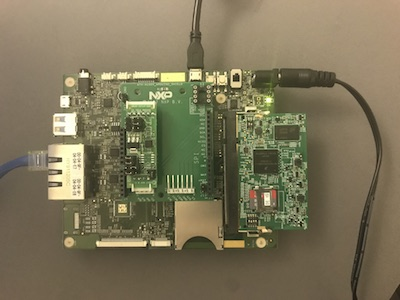

# IBM Watson™ IoT Platform C Client Library 
## For _NXP i_._MX_ Platform with IC A71CH Secure Element

This project contains C client library source that can be built and installed on devices
installed with _NXP i_._MX_ operating system, and interact with  the IBM Watson™ Internet of 
Things Platform. The library is customized to support 
*[NXP A71CH](https://www.nxp.com/products/identification-and-security/authentication/plug-and-trust-the-fast-easy-way-to-deploy-secure-iot-connections:A71CH)* Secure Element.

## Prerequisite

The client code code can be built only on _NXP i_._MX_ Platform. You need a working 
combination of *MCIMX6UL-EVKB* and *A71CH* boards. 



You must prepare and provision the board for building client code and connecting client 
to IBM Watson IoT Platform. Refer to the following documentation for 
[Provisioning A71CH](./provision_a71ch_for_watson_iot_demo.md) process.
Note that the tools needed to build the client library and samples, 
come pre-installed on the SD card image for *MCIMX6UL-EVKB* board.

To test device connectivity to your IBM Watson™ IoT organization, you need an
IBM Cloud account and an instance of IBM Watson IoT service in your IBM Cloud organization.

If you do not have an IBM Cloud account, [sign up](https://console.bluemix.net/registration/) for an IBM Cloud account.

If you do not have an instance of IBM Watson IoT Platform service, 
[create an instance](https://console.bluemix.net/catalog/services/internet-of-things-platform/)
in your IBM Cloud organization.

## Build requirements / compilation

The client code code can be built only on _NXP i_._MX_ Platform. The code is dependent on
[Paho MQTT C Client](http://www.eclipse.org/paho/clients/c/) version 1.2.0. The build
script will automatically download dependent packages, so internet access is a must
during build process.

### Download C Client Library Source

Use the following command to download the C Client Library source:

```
git clone https://github.com/ibm-watson-iot/iot-nxpimxa71ch-c
```

If git is not available on the system, use curl command to download project zip file:

```
curl -LJO https://github.com/ibm-watson-iot/iot-nxpimxa71ch-c/archive/master.zip
unzip iot-nxpimxa71ch-c.master.zip
mv iot-nxpimxa71ch-c.master iot-nxpimxa71ch-c
```

### Build and install Steps

Use the following commands to setup build tree and build C Client library and samples:

```
cd iot-nxpimxa71ch-c
make build
make install
```

Install step will install client library, header files, sample client binaries, configuration,
and certificates in the following directory locations:

| Directory Location | Content |
| ------------------ |:------- |
| /usr/local/lib | Client libraries |
| /usr/local/include | Header files for device client build |
| /opt/iotnxpimxclient/bin | Device client sample binaries |
| /opt/iotnxpimxclient/config | Configuration files for Device client samples |
| /opt/iotnxpimxclient/certs | Certificate used by Device client samples |

### Verify build by connecting to *Quickstart*

*Quickstart* is an open sandbox that you can use to quickly connect your device 
to the IBM Watson™ IoT Platform. 

1. Connect to *[quickstart](https://quickstart.internetofthings.ibmcloud.com/?cm_mc_uid=71367544061615028292336&cm_mc_sid_50200000=59540641520868549701#/)* organization of IBM Watson™ Internet of Things Platform.

* Select "I accept IBM's Terms of Use"
* Specify a device id to *70028004006194989053* to test connectivity. Note that this device ID 
need not be the actual device ID stored in *IC A71CH* Secure Element. Note that the device
configuration file */opt/iotnxpimxclient/config/device_quickstart.cfg* is set with device id
as *70028004006194989053*. If you use a different value for device *id* for this test, then you
will have to update the value of *id* in */opt/iotnxpimxclient/config/device_quickstart.cfg* file.

* Click *Go* button.

2. On Device system, run the following commands:

```
cd /opt/iotnxpimxclient/bin
./helloWorld --config /opt/iotnxpimxclient/config/device_quickstart.cfg
```
The test device will get connected to *Quickstart* and the Quickstart page will start showing
incoming simulated sensor data from the test device.


## Connect A71CH to *your own organization*

Use the following steps to register CA certificate, set connection security policy, and register
device type and device id with Watson IoT Platform. This section also describes the steps needed to
configure the device and connect to Watson IoT Platform.

### Register Certificate Authority

Register CA certificate created in Step 2 of A71CH provisioning process described in 
[Provisioning A71CH](./provision_a71ch_for_watson_iot_demo.md) document, with Watson IoT Platform.
Follow the instructions in the following section of Configuring certificates documentation:

[Registering Certificate Authority (CA) certificates for device authentication](https://console.bluemix.net/docs/services/IoT/reference/security/set_up_certificates.html#set_up_certificates)

### Configure Connection Security Policy

Set *Default Connection Security* to *TLS with Client Certificate Authentication*. For details on how to
configure connection security policy, refer to the section *Configuring connection security policies 
for advanced security"* in the following link:

[Configuring security policies](https://console.bluemix.net/docs/services/IoT/reference/security/set_up_policies.html#set_up_policies.md)

### Register Device Typies and Devices:

Devices installed with A71CH Secure Element can be configured as Watson IoT Platform device or Gateway.
Use the following link to register your device or gateway:

[Registering your device with Watson IoT Platform](https://console.bluemix.net/docs/services/IoT/iotplatform_task.html#iotplatform_task)

If you want to configure and connect a device, register *NXP-A71CH-D* as a generic device type.
If you want to configure and connect a gateway, register *NXP-A71CH-G* as a generic gateway type.
For device or gateway ID, use ID returned by the provisioning script "provisionA71CH_WatsonIoT.sh"
(described in Step 2 of 
[A71CH provisioning process](./provision_a71ch_for_watson_iot_demo.md) document with Watson IoT Platform).

### Configure and Connect device or gateway

The project contains samples client code for a device and a gateway.

#### Configure Sample Device

Edit sample device configuration file *device_a71ch.cfg* file in */opt/iotnxpimxclient/config* directory:

```
org=<orgid>
type=NXP-A71CH-D
id=<your device id - returned by A71CH provisioning script>
useClientCertificates=1
clientCertPath=/home/root/tools/<your device id>_device_ec_pem.crt
clientKeyPath=/home/root/tools/<your device id>.ref_key
rootCACertPath=/opt/iotnxpimxclient/certs/IoTFoundation.pem
useNXPEngine=1
```

#### Connect Sample Device Client

Use the following commands to connect your sample device client to Watson IoT Platform:

```
cd /opt/iotnxpimxclient/bin
./deviceSample --config /opt/iotnxpimxclient/config/device_a71ch.cfg
```

#### Configure Sample Gateway

Edit sample gateway configuration file *gateway_a71ch.cfg* file in */opt/iotnxpimxclient/config* directory:

```
org=<orgid>
type=NXP-A71CH-G
id=<your gateway id - returned by A71CH provisioning script>
useClientCertificates=1
clientCertPath=/home/root/tools/<your gateway id>_gateway_ec_pem.crt
clientKeyPath=/home/root/tools/<your gateway id>.ref_key
rootCACertPath=/opt/iotnxpimxclient/certs/IoTFoundation.pem
useNXPEngine=1
```

#### Connect Sample Gateway Client

Use the following commands to connect your sample gateway client to Watson IoT Platform:

```
cd /opt/iotnxpimxclient/bin
./gatewaySample --config /opt/iotnxpimxclient/config/gateway_a71ch.cfg
```


